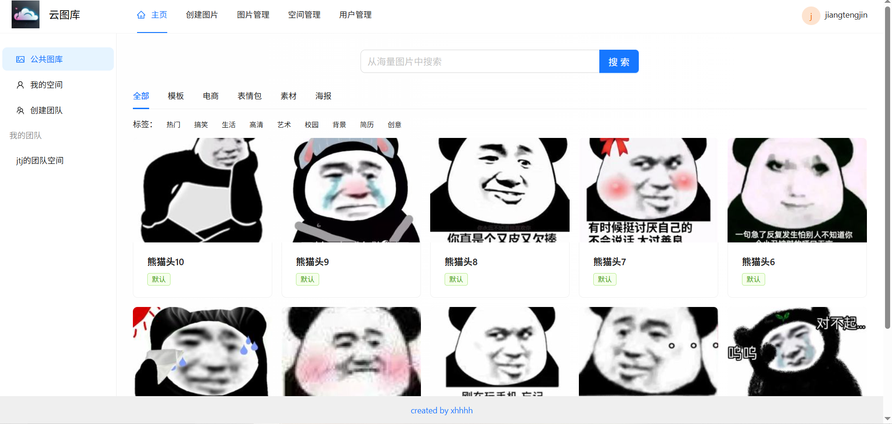
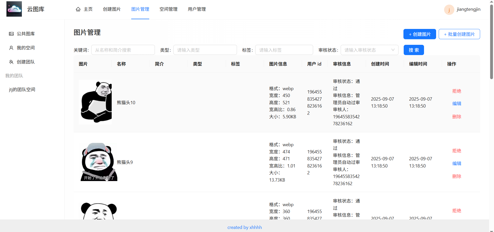
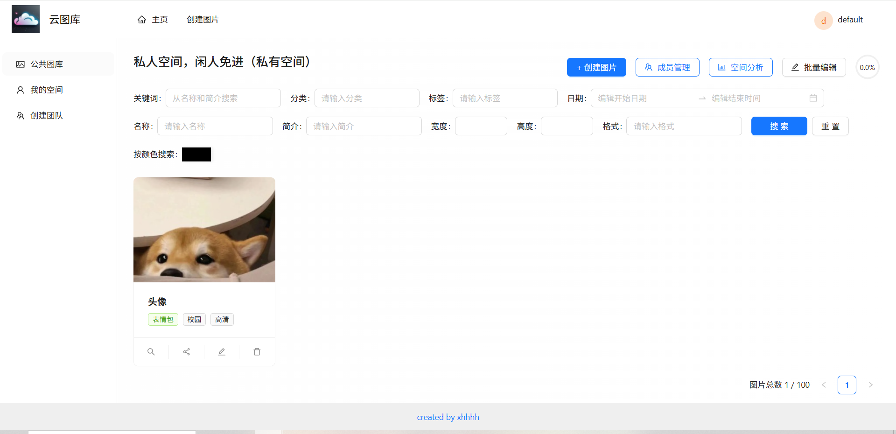
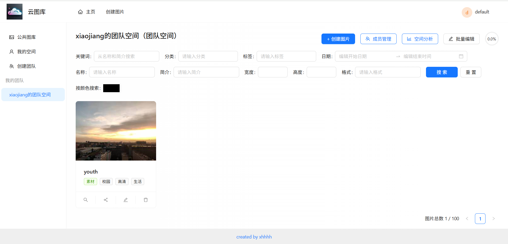
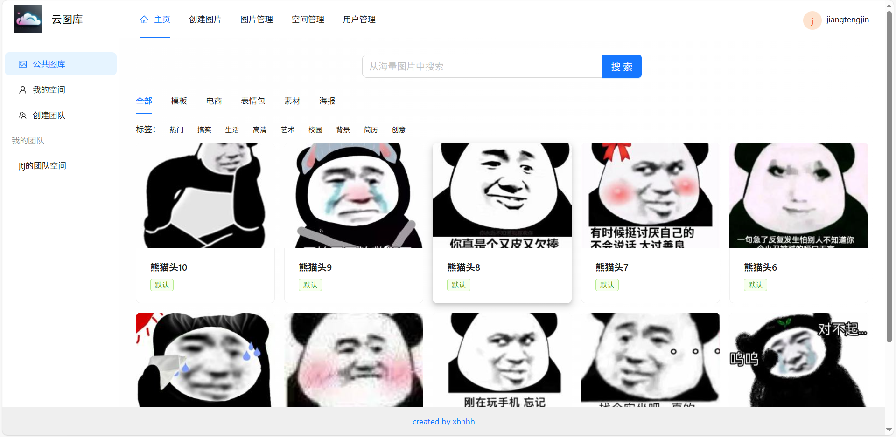
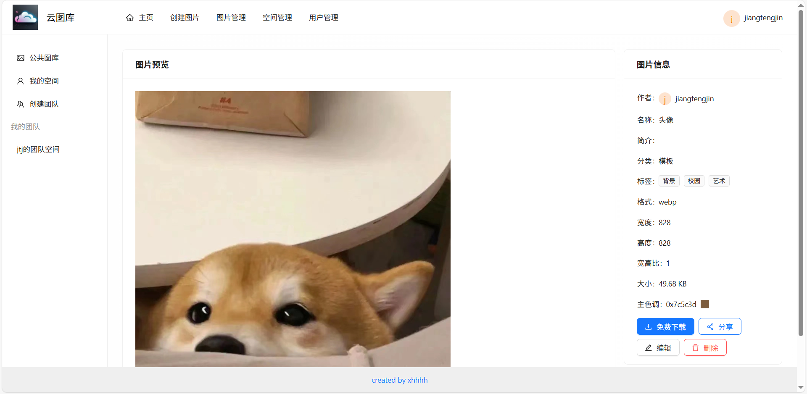
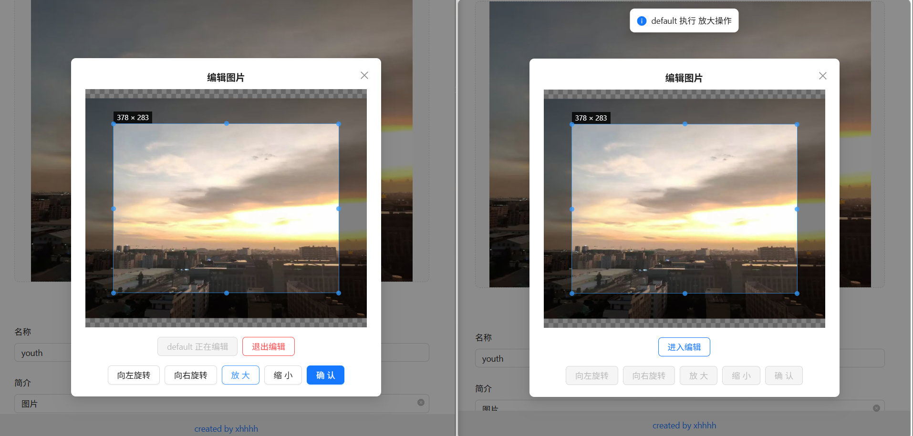

# 智能协同云图库 · 后端

基于 Vue 3 + Spring Boot + COS + WebSocket 的 **智能协同云图库平台**后端服务。

## 项目介绍

这个平台的应用场景非常广泛，核心功能可分为 4 大类：

1）所有用户都可以在平台公开上传和检索图片素材，快速找到需要的图片。可用作表情包网站、设计素材网站、壁纸网站等：



2）管理员可以上传、审核和管理图片，并对系统内的图片进行分析：



3）对于个人用户，可将图片上传至私有空间进行批量管理、检索、编辑和分析，用作个人网盘、个人相册、作品集等：



4）对于企业，可开通团队空间并邀请成员，共享图片并 **实时协同编辑图片**，提高团队协作效率。可用于提供商业服务，如企业活动相册、企业内部素材库等：



### 项目三大阶段

1）第一阶段，开发公共的图库平台。实战 Vue 3 + Spring Boot 图片素材网站的快速开发。

> 成果：可用作表情包网站、设计素材网站、壁纸网站等



2）第二阶段，对项目 C 端功能进行大量扩展。用户可开通私有空间，并对空间图片进行多维检索、扫码分享、批量管理、快速编辑、用量分析。

> 成果：可用作个人网盘、个人相册、作品集等


3）第三阶段，对项目 B 端功能进行大量扩展。企业可开通团队空间，邀请和管理空间成员，团队内共享图片并实时协同编辑图片。

> 成果：可用于提供商业服务，如企业活动相册、企业内部素材库等



项目架构设计图：


## 技术选型

### 后端

- Java 8 + Spring Boot 2.7.6 + Maven
- MySQL 8 数据库 + MyBatis-Plus 框架
- Redis 分布式缓存 + Spring Session
- Jsoup 数据抓取
- ⭐️ 腾讯云 COS 对象存储
- ⭐️ ShardingSphere 分库分表（picture 表按 spaceId 分片）
- ⭐️ Sa-Token 权限控制
- ⭐️ WebSocket 双向通信（协同编辑）
- ⭐️ Disruptor 高性能无锁队列
- ⭐️ JUC 并发和异步编程
- ⭐️ AI 绘图大模型接入（AI 扩图）
- ⭐️ Knife4j 接口文档

### 前端（配套，另起仓库）

- Vue 3 + Vite + Ant Design Vue + Axios + Pinia + TypeScript

## 目录结构

```
zcj-picture-backend-main/
├── pom.xml                          # Maven 依赖
├── sql/
│   └── create_table.sql             # 建表 SQL（含 user / picture / space / space_user / expand_picture_task）
├── src/main/java/com/xhh/yupicturebackend/
│   ├── YuPictureBackendApplication.java
│   ├── annotation/                  # 自定义注解（鉴权等）
│   ├── aop/                         # 切面
│   ├── api/                         # 第三方 API 对接（AI 扩图等）
│   ├── common/                      # 通用返回体、分页、常量
│   ├── config/                      # COS / Knife4j / Redis / ShardingSphere 等配置
│   ├── controller/                  # 接口层：user / picture / space / spaceUser / spaceAnalyze / file / image
│   ├── exception/                   # 全局异常处理
│   ├── manager/                     # COS 上传、分片算法等封装
│   ├── mapper/                      # MyBatis-Plus Mapper
│   ├── model/                       # entity / dto / vo / enums
│   ├── service/                     # 业务层
│   └── utils/
├── src/main/resources/
│   ├── application.yml              # 主配置（端口 / MySQL / Redis / COS / 分表）
│   └── biz/                         # 业务相关配置
└── httpTest/                        # 接口测试脚本
```

## 快速开始

### 1. 环境准备

| 依赖    | 版本要求      | 说明                          |
| ------- | ------------- | ----------------------------- |
| JDK     | 8+            | 推荐 JDK 8                    |
| Maven   | 3.6+          |                               |
| MySQL   | 8.x           | 字符集 utf8mb4                |
| Redis   | 6.x+          | Sa-Token 与 Session 依赖 Redis |
| 腾讯云 COS | —          | 需自行开通，获取 SecretId / SecretKey / Bucket / Region |

### 2. 建库建表

```sql
-- 创建数据库
CREATE DATABASE yu_picture CHARACTER SET utf8mb4 COLLATE utf8mb4_unicode_ci;
```

然后执行 `zcj-picture-backend-main/sql/create_table.sql` 建表（共 5 张表：user、picture、space、space_user、expand_picture_task）。

### 3. 修改配置

打开 `zcj-picture-backend-main/src/main/resources/application.yml`，按你的环境修改：

```yaml
spring:
  datasource:
    url: jdbc:mysql://localhost:3306/yu_picture   # 改为你的 MySQL 地址
    username: root                                 # 你的账号
    password: xxxx                                 # 你的密码
  redis:
    host: localhost                                # 你的 Redis 地址
    port: 6379
  shardingsphere:
    datasource:
      yu_picture:
        url: jdbc:mysql://localhost:3306/yu_picture  # 同上，保持一致
        username: root
        password: xxxx
# 腾讯云 COS 配置（secretId / secretKey / bucket / region，换成你自己的）
cos:
  client:
    host: https://xxx.cos.ap-xxx.myqcloud.com
```

> ⚠️ 注意：不要把真实的 SecretKey / 数据库密码提交到公开仓库，建议用环境变量或本地配置覆盖。

### 4. 启动

```bash
cd zcj-picture-backend-main
mvn clean package -DskipTests
java -jar target/*.jar
# 或直接
mvn spring-boot:run
```

启动成功后：

- 服务地址：http://localhost:8123/api
- 健康检查：GET http://localhost:8123/api/health
- 接口文档（Knife4j）：http://localhost:8123/api/doc.html

### 5. 注册管理员

1. 调用 `POST /api/user/register` 注册一个普通用户；
2. 在 `user` 表中把该用户的 `userRole` 字段改为 `admin`，即获得管理员权限（图片审核等接口需要 admin）。

## 接口一览

> 完整可交互文档见 Knife4j：http://localhost:8123/api/doc.html（启动后访问）

| 模块     | 方法 | 路径 | 说明 |
| -------- | ---- | ---- | ---- |
| 健康检查 | GET | `/api/health` | 服务是否正常 |
| 用户 | POST | `/api/user/register` | 注册 |
| 用户 | POST | `/api/user/login` | 登录 |
| 用户 | GET | `/api/user/get/login` | 获取当前登录用户 |
| 用户 | POST | `/api/user/logout` | 登出 |
| 用户 | POST | `/api/user/list/page/vo` | 分页查询用户（admin） |
| 图片 | POST | `/api/picture/upload` | 上传图片（文件） |
| 图片 | POST | `/api/picture/upload/url` | 上传图片（URL 抓取） |
| 图片 | POST | `/api/picture/upload/batch` | 批量抓取上传（admin） |
| 图片 | POST | `/api/picture/list/page/vo` | 分页搜索图片 |
| 图片 | POST | `/api/picture/list/page/vo/cache` | 分页搜索（多级缓存版） |
| 图片 | POST | `/api/picture/edit` | 编辑图片 |
| 图片 | POST | `/api/picture/edit/batch` | 批量编辑 |
| 图片 | POST | `/api/picture/delete` | 删除图片 |
| 图片 | POST | `/api/picture/review` | 图片审核（admin） |
| 图片 | GET | `/api/picture/tag_category` | 标签/分类下拉 |
| 图片 | POST | `/api/picture/search/picture` | 以图搜图 |
| 图片 | POST | `/api/picture/search/color` | 按颜色搜图 |
| 图片 | POST | `/api/picture/out-painting/create_task` | AI 扩图创建任务 |
| 图片 | GET | `/api/picture/out-painting/get_task` | 查询扩图任务 |
| 空间 | POST | `/api/space/add` | 开通空间 |
| 空间 | POST | `/api/space/list/page/vo` | 分页查询空间 |
| 空间 | POST | `/api/space/edit` | 编辑空间 |
| 空间 | POST | `/api/space/delete` | 删除空间 |
| 空间 | GET | `/api/space/list/level` | 空间级别列表 |
| 空间成员 | POST | `/api/spaceUser/add` | 添加成员 |
| 空间成员 | POST | `/api/spaceUser/list` | 成员列表 |
| 空间成员 | POST | `/api/spaceUser/edit` | 编辑成员角色 |
| 空间成员 | POST | `/api/spaceUser/delete` | 移除成员 |
| 空间成员 | POST | `/api/spaceUser/list/my` | 我加入的团队空间 |
| 空间分析 | POST | `/api/space/analyze/usage` | 空间用量分析 |
| 空间分析 | POST | `/api/space/analyze/category` | 分类占比分析 |
| 空间分析 | POST | `/api/space/analyze/tag` | 标签分析 |
| 空间分析 | POST | `/api/space/analyze/size` | 图片大小分析 |
| 空间分析 | POST | `/api/space/analyze/user` | 用户上传分析 |
| 空间分析 | POST | `/api/space/analyze/rank` | 空间排行 |
| 文件 | POST | `/api/file/test/upload` | 文件上传测试 |
| AI 扩图任务 | POST | `/api/image/expand/task/page` | 扩图任务分页 |

## 常见问题 FAQ

**Q1：启动报错数据库连接失败？**
检查 MySQL 是否启动、`yu_picture` 库是否已创建、`application.yml` 里两处（datasource 和 shardingsphere）地址/账号/密码是否正确且一致。

**Q2：启动报 Redis 连接失败？**
Sa-Token 和 Spring Session 都依赖 Redis，先确认 Redis 已启动、host/port 配置正确。

**Q3：图片上传失败？**
检查腾讯云 COS 的 secretId / secretKey / bucket / region 是否配置正确、Bucket 是否有公有读权限、secretKey 是否过期。

**Q4：端口 8123 被占用？**
修改 `application.yml` 中 `server.port`，或停掉占用端口的进程。

**Q5：Knife4j 文档打不开？**
确认 `knife4j.enable: true`，访问 http://localhost:8123/api/doc.html（注意带 `/api` 前缀）。

**Q6：普通用户看不到审核按钮？**
审核等管理接口需要 `admin` 角色，按「快速开始」第 5 步把 `user` 表的 `userRole` 改为 `admin`。

**Q7：picture 表数据存到哪里去了？**
picture 表按 `spaceId` 做了 ShardingSphere 动态分表，公共图库（spaceId 为空）走默认表，私有/团队空间图片按空间分片。

## 部署建议

- 生产环境建议把 `application.yml` 中的敏感配置（数据库密码、COS 密钥）改走环境变量或配置中心注入，不要硬编码提交。
- 建议开启 MyBatis-Plus 的逻辑删除与分页插件已默认启用；大文件上传可按需调大 `spring.servlet.multipart.max-file-size`。
